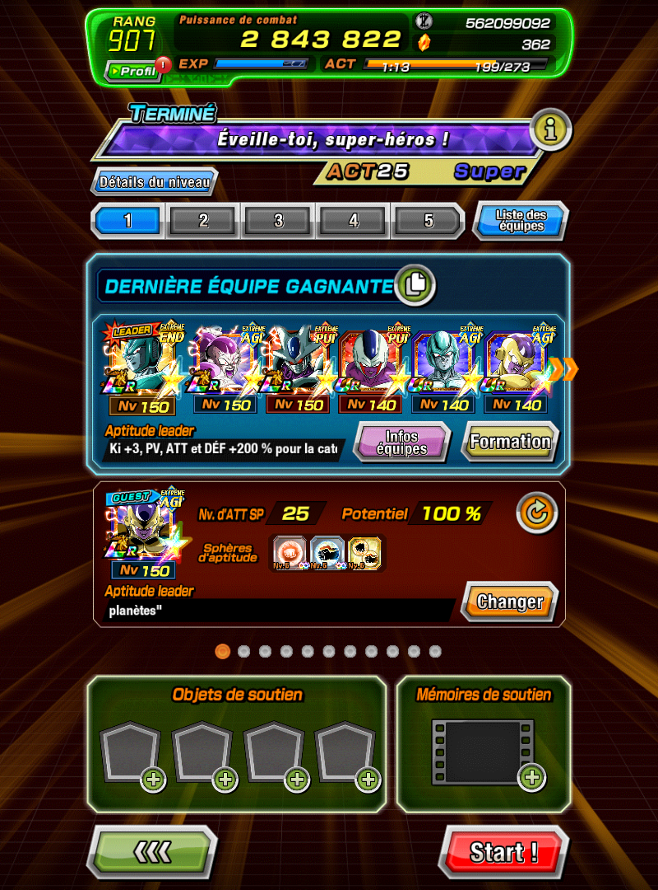

# Dokkan Semi-LegitBot

An automation bot for Dragon Ball Z: Dokkan Battle that helps automate level farming and ZTUR (Zen Awakening) farming using ADB (Android Debug Bridge).

## Features

- **Auto Level**: Automatically repeats levels a specified number of times
- **ZTUR Finish**: Completes ZTUR levels until reaching a target level
- **ZTUR Retry**: Farms medals (Bronze, Silver, Gold, Rainbow) for sub ZTUR characters
- **Stamina Management**: Automatically handles stamina recovery using items or Dragon Stones (configurable)
- **Friend Request Handling**: Automatically handles friend requests and "too many friends" pop-ups

## Requirements

- Python 3.x
- Android emulator (BlueStacks, Nox, LDPlayer, etc.) or physical device with USB debugging enabled
- Tesseract OCR installed (for text recognition)
  - Windows: Download from [GitHub](https://github.com/UB-Mannheim/tesseract/wiki)
  - The script expects Tesseract at: `C:\Program Files\Tesseract-OCR\tesseract.exe`

## Installation

1. Clone or download this repository
2. Ensure `platform-tools` folder with `adb.exe` is in the project root
3. Install Python dependencies (the bot will auto-install them on first run):
   - Pillow
   - pytesseract
   - opencv-python
   - numpy

## Configuration

Edit `config.json` to configure stamina recovery behavior:

```json
{
    "use_meat_first": false,
    "use_dragon_stones": false
}
```

- `use_meat_first`: If `true`, the bot will use food/meat items for stamina recovery (takes priority over Dragon Stones)
- `use_dragon_stones`: If `true` and `use_meat_first` is `false`, the bot will use Dragon Stones for stamina recovery

## Usage

1. Start your Android emulator or connect your device with USB debugging enabled
2. Run the main script:
   ```bash
   python dokkan-bot.py
   ```
3. Select a mode from the menu:
   - **1. Auto Level**: Farm a specific level multiple times
   - **2. ZTUR Finish**: Complete ZTUR levels until reaching a target level
   - **3. ZTUR Retry**: Farm medals for ZTUR characters

### Auto Level Mode

**Starting Position:** Make sure you are on the level selection screen (team selection screen) before starting this mode.



- Enter the number of times you want to repeat the level
- The bot will automatically:
  - Start each run
  - Handle friend requests
  - Restore stamina when needed (according to config)
  - Complete and restart the level

### ZTUR Finish Mode

**Starting Position:** Make sure you are on the ZTUR level selection screen before starting this mode.


- Enter your target ZTUR level
- Enter the current enemy level
- The bot calculates and completes the required number of runs
- Navigates back to ZTUR screen after each completion

### ZTUR Retry Mode

**Starting Position:** Make sure you are on the ZTUR level selection screen before starting this mode.


- Enter the number of characters that have undergone ZTUR
- The bot will farm medals in this order:
  1. Bronze Medals (6 runs per character)
  2. Silver Medals (5 runs per character)
  3. Gold Medals (3 runs per character)
  4. Rainbow Medals (3 runs per character)
- Automatically handles stamina recovery and death detection


## How It Works

The bot uses:
- **ADB (Android Debug Bridge)**: To capture screenshots and simulate taps
- **OpenCV**: For template matching (finding images on screen)
- **Tesseract OCR**: For text recognition (finding "OK" buttons, etc.)
- **PIL/Pillow**: For image processing

The bot monitors the game screen, detects specific UI elements (buttons, colors, images), and performs actions automatically.

## Important Notes

- Your emulator screen resolution needs to be 800x1080 with 200 DPI

## Troubleshooting

### "No device connected"
- Ensure your emulator is running
- For physical devices: Enable USB debugging in Developer Options
- Check that ADB can see your device: `adb devices`

### OCR not working
- Verify Tesseract is installed at the expected path
- Check that the English language pack is installed


